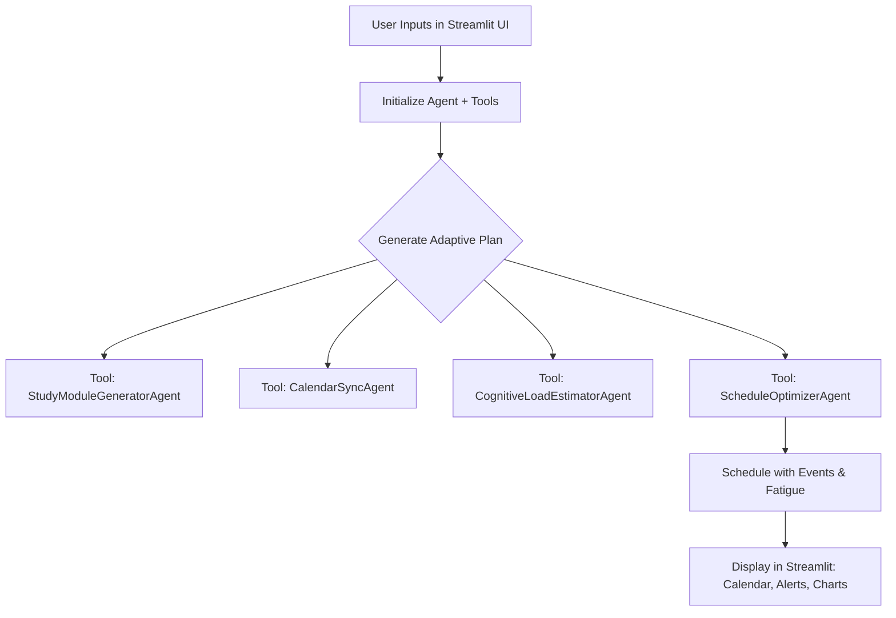

# README: Agent-Based Workflow for Life Event-Aware Study Planner

## 📌 Overview

This application is an AI-powered study planner built using **Streamlit**, **LangChain**, and **Google Generative AI (Gemini)**. It personalizes a student's study plan by considering life events, cognitive load, and knowledge from research documents (via RAG).

The core logic is structured around **LangChain Agents** that manage distinct functionalities like schedule optimization, fatigue analysis, and calendar parsing.

---

## 🚀 Agent Framework Overview

The system uses **LangChain's ReAct Agent** via the `create_react_agent` method, and assigns it a set of **custom tools** (functions) that encapsulate logic in modular agent classes.

### ✅ Why Use LangChain Agents?

* **Reason + Act** (ReAct): The agent can reason through which tool to use and act accordingly.
* **Tool-based Abstraction**: Tools wrap complex logic and LLM calls.
* **Modularity**: Agents are separated for different responsibilities.

---

## 🔁 High-Level Workflow

```text
1. User opens Streamlit UI
2. Enters study profile & uploads PDFs / events
3. Initializes agent + RAG knowledge base
4. Agent is called to generate modules, schedule, and recommendations
5. Output is visualized (calendar, alerts, recommendations)
```

---

## 🧠 Agents & Tools Table

| Tool / Agent Class                       | Description                                                          |
| ---------------------------------------- | -------------------------------------------------------------------- |
| `CalendarSyncAgent`                      | Parses uploaded events or generates realistic ones using LLM         |
| `CognitiveLoadEstimatorAgent`            | Calculates stress, fatigue, and mental load from events + hours      |
| `ScheduleOptimizerAgent`                 | Uses LLM to create a 30-day adaptive schedule avoiding conflicts     |
| `StudyModuleGeneratorAgent`              | Generates study modules from user goals and availability             |
| `PersonalizationFrameworkRetrieverAgent` | Initializes RAG system from PDFs and answers study-related questions |

These are registered as LangChain **Tools**, and executed via an **AgentExecutor**.

---

## ⚙️ LangChain Agent Setup

```python
from langchain.agents import Tool, create_react_agent, AgentExecutor
from langchain import hub

llm = GoogleGenerativeAI(model="gemini-1.5-flash", google_api_key=api_key)

# Define tools
tools = [
    Tool(name="CalendarSync", func=...),
    Tool(name="StudyModuleGenerator", func=...),
    Tool(name="ScheduleOptimizer", func=...),
    Tool(name="CognitiveLoadEstimator", func=...)
]

# Use ReAct prompt from LangChain Hub
prompt = hub.pull("hwchase17/react")

# Create agent
agent = create_react_agent(llm, tools, prompt)
agent_executor = AgentExecutor(agent=agent, tools=tools, verbose=True)
```

This `agent_executor` is stored in session state and reused throughout the Streamlit app.

---

## 📈 Flowchart: Agent-Orchestrated Workflow



---

## 💡 Example Agent Interaction

```
Thought: I need to create study modules first
Action: StudyModuleGenerator
Action Input: {profile}
Observation: [List of modules returned]

Thought: Now I need to evaluate fatigue
Action: CognitiveLoadEstimator
Action Input: {events, study_hours}
Observation: {mental_load: 0.7, stress_level: 0.5, ...}

Thought: Time to generate the final schedule
Action: ScheduleOptimizer
Action Input: {modules, events, fatigue}
Observation: [Schedule JSON]
```

---

## 📚 Supporting Technologies

* **LangChain**: Agent framework, RAG interface, tool abstraction
* **Google Generative AI (Gemini)**: LLM model for reasoning, JSON generation
* **Streamlit**: UI frontend with charts and forms
* **FAISS**: Vector store for RAG PDF integration
* **PyPDF2**: Parsing knowledge base documents

---

## 📎 Conclusion

This system is an example of a practical, production-ready LangChain agent implementation. Each feature is encapsulated as a tool-like module, making it scalable, testable, and explainable.

> To extend this system, just write a new `AgentClass`, wrap it in a `Tool(...)`, and register it with the agent.

---

For any further questions, see `hack.py` or open an issue!
