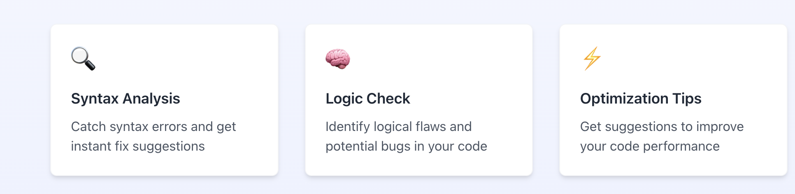
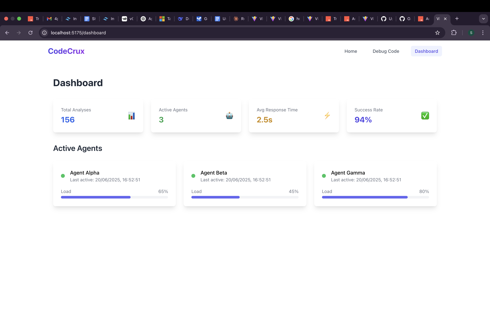

# Agentic Code Feedback System

An AI-powered debugging and tutoring assistant designed for LMS platforms to help learners write, debug, and understand code.

## ✨ Features

* Syntax validation with fix suggestions
* Logical flaw detection
* Code optimization recommendations
* RAG (Retrieval-Augmented Generation)-based conceptual explanations
* Progressive hinting mechanism
* Persistent feedback history per learner

## 📊 Architecture Overview

### Agentic Workflow

```text
+-------------+      +------------------+       +---------------------+
| Learner UI  | ---> | /analyze-code API | ---> |  Agentic Workflow   |
+-------------+      +------------------+       +---------------------+
                                                   |
                                                   v
        +-------------------+   +------------------+   +------------------+
        | Syntax Validator  |   | Logic Consistency|   | Optimization Tool|
        +-------------------+   +------------------+   +------------------+
                \                    |                        /
                 \                   |                       /
                  \------------------|----------------------/
                                     |
                                     v
                        +-------------------------------+
                        | RAG-powered Concept Explainer  |
                        +-------------------------------+
                                     |
                                     v
                        +-------------------------------+
                        | Progressive Hint Generator     |
                        +-------------------------------+
                                     |
                                     v
                         +----------------------------+
                         | MongoDB: Store & Retrieve  |
                         +----------------------------+
```

### Agents (Functional Units)

* **Syntax Validator Agent**

  * Uses Gemini LLM to identify syntax errors.
  * Returns line number, error message, and a fix suggestion.

* **Logic Consistency Agent**

  * Detects logical flaws like infinite loops, faulty recursion, etc.

* **Optimization Agent**

  * Offers performance improvements based on time/space complexity.

* **Explanation Agent (RAG)**

  * Uses FAISS + HuggingFace embeddings for concept retrieval.
  * Provides beginner-friendly conceptual explanations.

* **Hint Agent**

  * Gives 3 levels of hints (general to specific).
  * Supplies a final fixed version of code.

  ## 🧠 Agent-Only Architecture Diagram (Agentic Workflow)

```text
run_manual_workflow()
├── Syntax Validator  
│   └── Input: code, language  
│   └── Output: [{ line, message, fix_suggestion }]
│
├── Logic Consistency Checker  
│   └── Input: code, language  
│   └── Output: [{ context, explanation }]
│
├── Optimization Advisor  
│   └── Input: code, language  
│   └── Output: [{ original_code, optimized_code, rationale }]
│
├── Feedback Explainer (RAG)  
│   └── Input: syntax_issues + logic_flaws  
│   └── Output: [{ concept, explanation, example_code }]
│
└── Progressive Hinter  
    └── Input: code + all aggregated issues  
    └── Output:
        - hint_trail: [ {level, hint, timestamp} ]
        - final_fix: full corrected code
```

Each agent module is a standalone function and can be independently tested or parallelized.

Agents use Gemini via LangChain + JSON output parsing.

**Note:** Error resilience is ensured via `tenacity`-based retry wrapping on all LLM calls.

---


## 📄 MongoDB Schema

### 1. `code_submissions`

```json
{
  "session_id": "uuid",
  "learner_id": "learner123",
  "code": "...code string...",
  "language": "python",
  "timestamp": ISODate
}
```

### 2. `feedback_history`

```json
{
  "session_id": "uuid",
  "syntax_issues": [
    {"line": 2, "message": "missing colon", "fix_suggestion": "Add colon at end"}
  ],
  "logic_flaws": [
    {"context": "loop", "explanation": "Infinite loop detected"}
  ],
  "optimizations": [
    {
      "original_code": "for i in range(len(arr)):...",
      "optimized_code": "for val in arr:...",
      "rationale": "Avoids indexing, better readability"
    }
  ],
  "explanations": [
    {
      "concept": "Loop Invariant",
      "explanation": "Helps ensure loop correctness",
      "example_code": "..."
    }
  ],
  "hint_trail": [
    {"level": 1, "hint": "Check loop boundaries", "timestamp": ISODate}
  ],
  "final_fix": "...fully fixed code..."
}
```

## ✅ API Endpoints

### `POST /analyze-code`

* Accepts learner ID, code, and language.
* Returns full feedback response.

### `GET /history/{learner_id}`

* Lists all submissions by a learner.

### `GET /hints/{session_id}`

* Returns hint trail and final fix.

## 🌐 Tech Stack

* **Backend**: FastAPI, LangChain, Gemini, FAISS, HuggingFace
* **Database**: MongoDB (AsyncIO)
* **Embeddings**: MiniLM-L6-v2

## 📷 Frontend Images & 🎥 Demo Video

1. 
2. 
3. 
4. [🎥 Watch Demo Video](./frontend/src/assets/video.mov)

## 📅 Future Improvements

* Add support for more languages (e.g. Java, C++)
* Real-time inline feedback
* Gamified learning scores

---

MIT License | OpenAI / LangChain Integration
